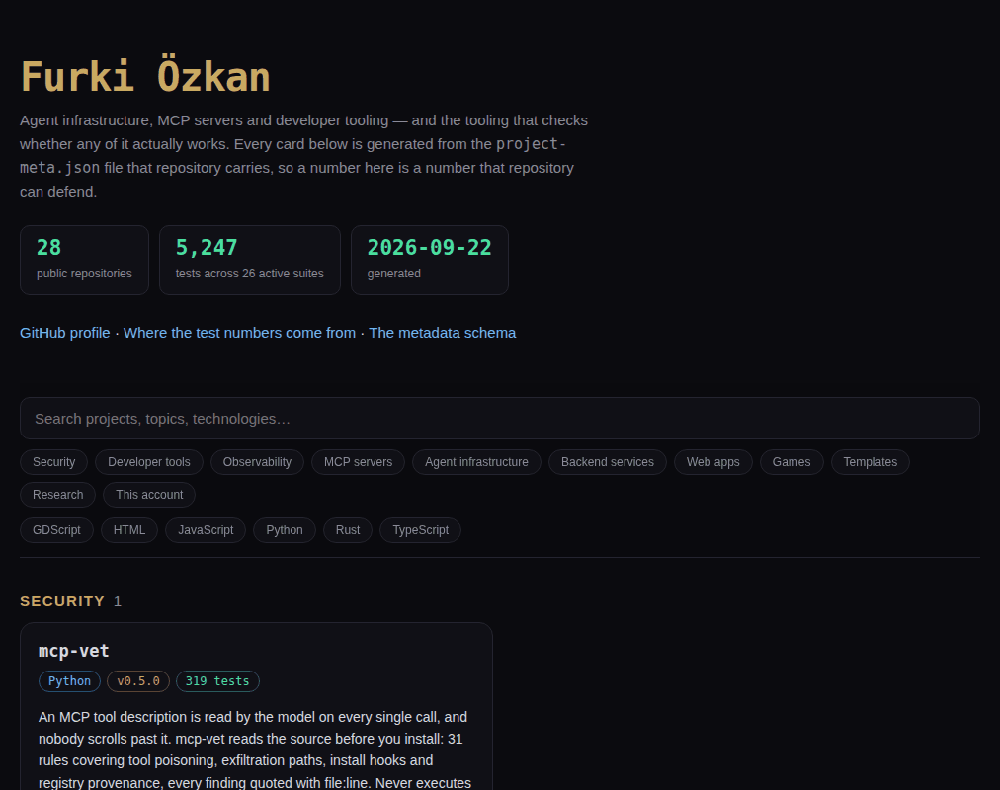

# furkiozknn.github.io

The project directory for [this account](https://github.com/Furkiozknn): every public
repository, in one searchable page.

**→ [furkiozknn.github.io](https://furkiozknn.github.io/)**

<a href="https://furkiozknn.github.io/"></a>

<sub>A real render of <code>index.html</code> from the snapshot in <code>veri/</code>, taken with headless Chromium. The page also follows a light system theme.</sub>

Nothing on the page is written here. `uret.py` reads the `project-meta.json` that every
repository carries — identity, version, status, platform, key features, and the test count
together with the runner line it came from — writes the snapshot to
[`veri/projeler.json`](veri/projeler.json) and renders `index.html` from it. A field that is
`null` in the metadata is left off the page rather than filled in with a plausible-looking
string, which is the same rule the
[schema](https://github.com/Furkiozknn/Furkiozknn/blob/main/schema/README.md) follows.

A scheduled workflow rebuilds it every Monday and commits only when the output actually
changes, so the page cannot quietly fall behind the repositories it describes.

```sh
python3 uret.py            # fetch every repository's metadata, then render
python3 uret.py --yerel    # render from the snapshot already in veri/
python3 -m pytest tests -q # 48 tests over the generator
```

No build step, no dependencies, one HTML file. To look at it locally, serve the folder
(`python3 -m http.server`) and open <http://localhost:8000/>.

## Linking to a project

Every card has the repository's name as its id, and most repositories on the account use
that anchor as their GitHub homepage — `https://furkiozknn.github.io/#mcp-vet` opens this page
scrolled to the `mcp-vet` card and outlines it. The search and filter bar stays pinned at the
top on a wide screen, so the page measures it and lands a linked card below it rather than
underneath; on a phone the bar scrolls away with the page instead of pinning a third of the
screen. A card whose homepage *is* its own anchor gets no "Live" link, since that would only
link the card to itself.

The page follows the reader's light or dark system theme, the search box and the filter
groups are labelled, each filter reports whether it is on (`aria-pressed`), a screen reader
hears how many projects a filter leaves, and <kbd>/</kbd> jumps to the search.

## When a repository's prose disagrees with its own count

A card shows a repository's `summary` next to its test-count chip. A summary written when the
suite was smaller puts two numbers on one card — "319 tests" in the chip, "289 tests" in the
sentence beside it. The generator cannot fix that without writing text of its own, so it names
it instead: every rebuild prints a `::warning` annotation per disagreement, and the fix goes
into that repository's `project-meta.json`.

## What the tests are for

The page is generated, so the generator is the only thing here that can break — and
it breaks quietly. A malformed feed, a sitemap that does not parse, a JSON-LD block
with a trailing comma: a browser shows the page regardless and nobody notices for
weeks.

So the suite checks the two failure modes that actually happen. First, the null rule:
a field that is `null` in a repository's metadata has to leave the page *shorter*,
never print the word `None` where a reader would take it for a fact. Every optional
field is tested for that individually. Second, well-formedness: the feed and the
sitemap are parsed as XML, the JSON-LD block is parsed out of the rendered page and
validated, and the page itself is walked for unbalanced tags. The committed `index.html`,
`feed.xml` and `sitemap.xml` have to be byte-for-byte what the snapshot renders, so a hand
edit or a template change committed without re-rendering fails. The accessibility and
linking behaviour above is held by tests too, including one that every `#name` homepage
in the snapshot still finds its card. The suite also renders
the real snapshot in [`veri/`](veri/), so a change that works on fixtures but breaks
on the real projects fails in CI rather than on the live site.

Writing them found a real one: a repository whose `summary` was `null` crashed the
whole build, because `.get("summary", "")` returns `None` when the key is present
and null. Every repository happened to have a summary, so nothing had failed yet.

## Following it without opening it

The same run writes three things a machine can read, so the account can be followed without
anyone polling the page:

| File | What it is |
| --- | --- |
| [`veri/projeler.json`](veri/projeler.json) | the snapshot the page is rendered from — every repository's metadata, one JSON document |
| [`feed.xml`](https://furkiozknn.github.io/feed.xml) | an Atom feed of every release across the repositories, read from the GitHub API, newest first |
| [`sitemap.xml`](https://furkiozknn.github.io/sitemap.xml) + `robots.txt` | so search engines index the directory rather than guess at it |

The page itself also carries a `schema.org` `ItemList` in JSON-LD, built from the same
metadata, so a crawler sees the project list rather than a wall of markup. A release that does
not exist contributes no feed entry, and a repository the API will not answer for contributes
none either — the feed is short rather than invented.

## Licence

MIT — see [LICENSE](LICENSE).
